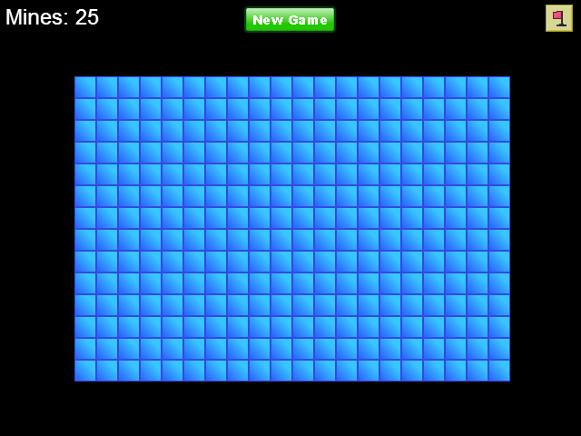
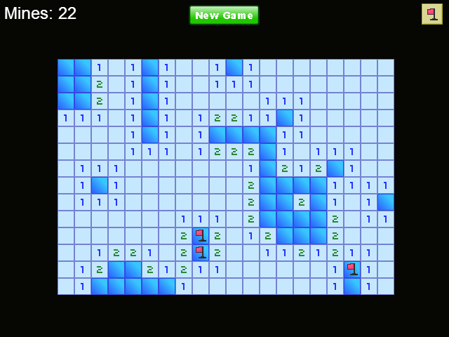
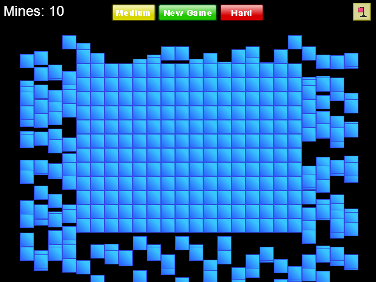
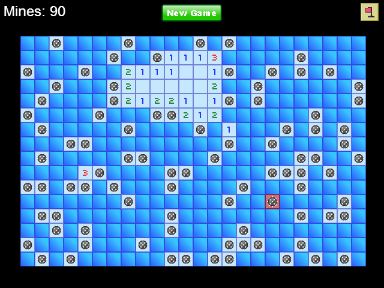
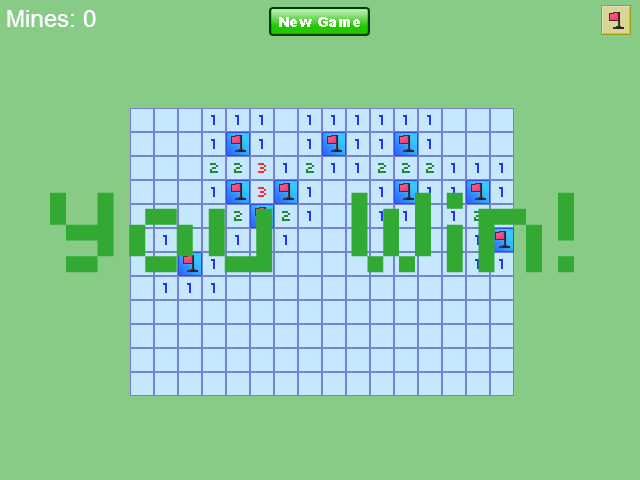

Minesweeper
===========

This is my first browser game, written in Flash ActionScript 3.

[Play it here](http://www.joeyespo.com/minesweeper).

Playing
=======

To play the game, go to the bin directory and open index.html in a web
browser. You may have to install Flash, if its currently not installed.

Screenshots
===========

Built with :heart: Enjoy!
